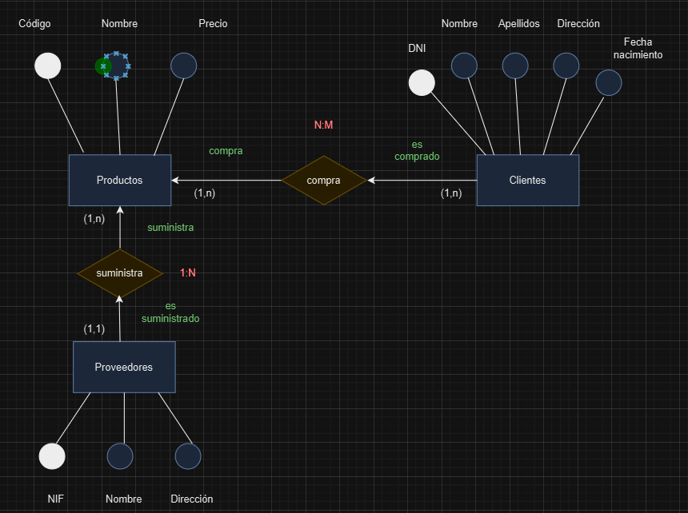

## Ejercicio 1

A partir del siguiente enunciado se desea realizar el modelo entidad-relación.

Una empresa vende productos a varios clientes. Se necesita conocer los datos personales de los clientes (nombre, apellidos, dni, dirección y fecha de nacimiento). La dirección del cliente debe contemplar el tipo de vía, el nombre, el número y el código postal. Cada producto tiene un nombre y un código, así como un precio unitario. Un cliente puede comprar varios productos a la empresa, y un mismo producto puede ser comprado por varios clientes.

Se debe tener en cuenta que un producto solo puede ser suministrado por un proveedor, y que un proveedor puede suministrar diferentes productos. De cada proveedor se desea conocer el NIF, nombre y dirección.

!