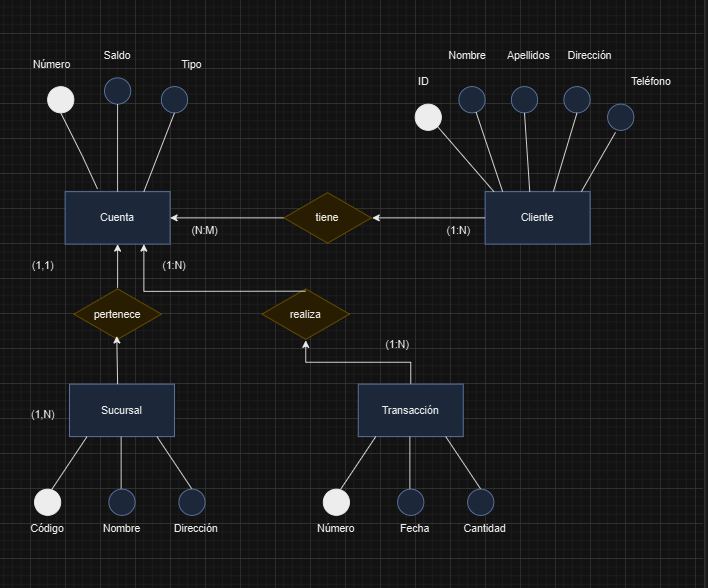

## Ejercicio 3

A partir del siguiente enunciado diseñar el modelo entidad-relación.

Se desea diseñar una BD de una entidad bancaria que contenga información sobre los clientes, las cuentas, las sucursales y las transacciones producidas. Construir el Modelo E/R teniendo en cuenta las siguientes restricciones:

Una transacción viene determinada por un número de transacción (único para cada cuenta), la fecha y la cantidad.
Un cliente puede tener muchas cuentas.
Una cuenta puede ser de muchos clientes.
Una cuenta sólo puede estar en una sucursal.

