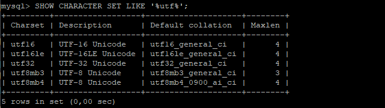
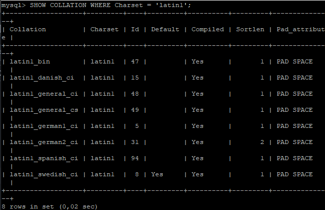
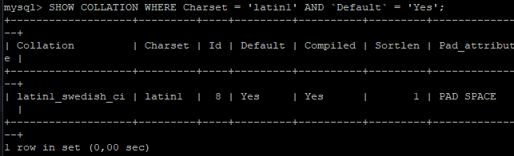
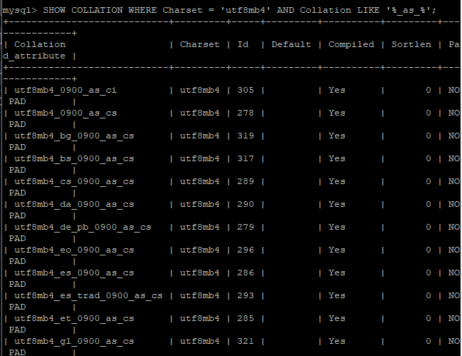
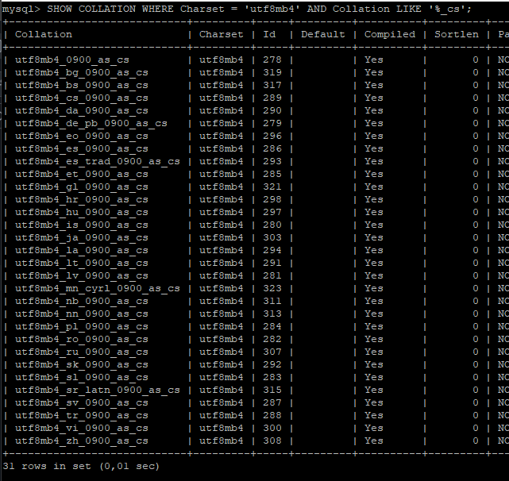
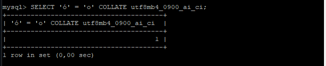
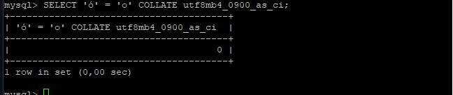
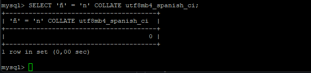
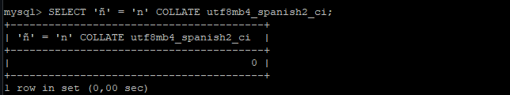

### Ejercicio 1.

* Mostrar todos los conjuntos de caracteres para que contengan la palabra `utf`.

`SHOW CHARACTER SET LIKE '%utf%'`

### Ejercicio 2.

* Muestra todos los collations disponibles para el conjunto de caracteres `latin1`.

`SHOW COLLATION WHERE Charset = 'latin1';`

* ¿Cuál es el collation predeterminado de `latin1`.

``SHOW COLLATION WHERE Charset = 'latin1' AND `Default` = 'Yes';``

### Ejercicio 3.

* Filtra las collations del conjunto `utf8mb4` que sean sensibles a acentos (as).

`SHOW COLLATION WHERE Charset = 'utf8mb4' AND Collation LIKE '%_as_%';`

* Filtra las collations del conjunto `utf8mb4` que sean sensibles a mayúsculas (cs).

`SHOW COLLATION WHERE Charset = 'utf8mb4' AND Collation LIKE '%_cs';`

### Ejercicio 4. 

* Compara si `ó` es igual a `o` utilizando el collation `utf8mb4_0900_ai_ci`.

`SELECT 'ó' = 'o' COLLATE utf8mb4_0900_ai_ci;`

_El resultado es 1 (true), lo que confirma que, bajo el collation mencionado `ó`se considera equivalente a `o`._

*Compara si `ó` es diferente de `o` utilizando el collation `utf8mb4_0900_as_ci.`

`SELECT 'ó' = 'o' COLLATE utf8mb4_0900_as_ci;`

_El resultado es 0 (false), lo cual significa que, bajo el collation mencionado, debido a su sensibilidad a acentos (as), `ó`no es equivalente a `o`._

### Ejercicio 5.

* Compara si la `ñ` es igual a `n` utilizando los collations `utf8mb4_spanish_ci` y `utf8mb4_spanish2_ci`.

`SELECT 'ñ' = 'n' COLLATE utf8mb4_spanish_ci;`

_El resultado es 0, lo cual significa que, bajo el collation `utf8mb4_spanish_ci`, la `ñ` no es equivalente a la `n`._

`SELECT 'ñ' = 'n' COLLATE utf8mb4_spanish2_ci;`

_El resultado de la consulta es 0, lo que indica que bajo el collation `utf8mb4_spanish2_ci`, la `ñ` no es equivalente a la `n`._