### Ejercicio 1. Muestra todas las variables del sistema disponibles en MySQL.

`SHOW VARIABLES;`

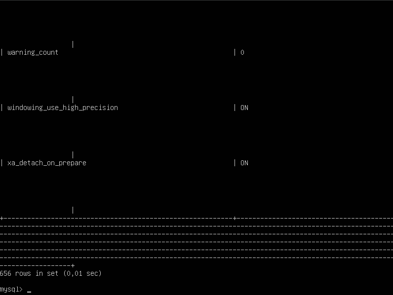

_El formato que estamos viendo (columnas desalineadas y difícil de leer) es típico del cliente de MySQL cuando se trabaja directamente desde la terminal con muchas líneas de salida. Si ejecutamos el comando `SHOW VARIABLES \G;`mostrará cada variable en una línea separada y mejorará la visualización:_

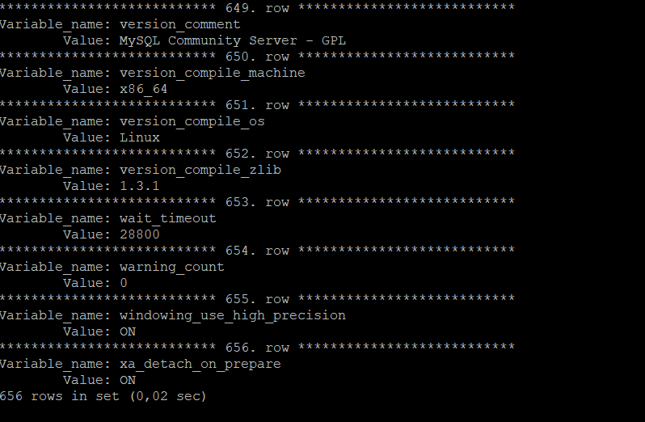

### Ejercicio 2. Muestra todas las variables del sistema que contengan la palabra size.

`SHOW VARIABLES LIKE '%size%';`

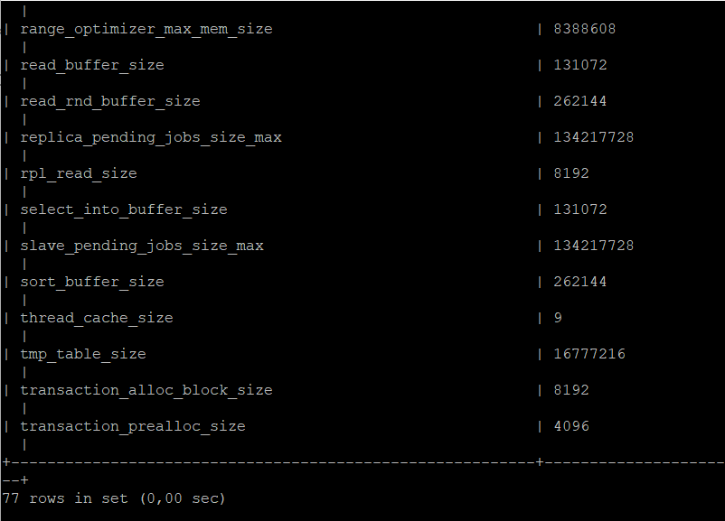

### Ejercicio 3. Encuentra todas las variables del sistema cuyo nombre comience con la palabra innodb.

`SHOW VARIABLES LIKE 'innodb%';`

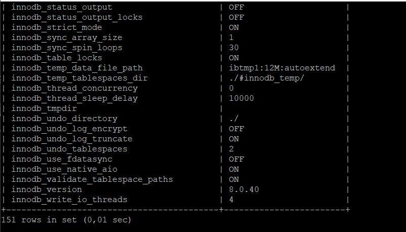

### Ejercicio 4. Encuentra todas las variables del sistema cuyo nombre termine con timeout.

`SHOW VARIABLES LIKE '%timeout';`

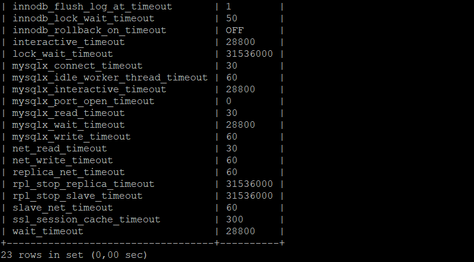

### Ejercicio 5. Muestra el valor exacto de la variable max_allowed_packet.

`SHOW VARIABLES LIKE 'max_allowed_packet';`

### Ejercicio 6. Muestra el valor exacto de la variable bind-address.

`SHOW VARIABLES LIKE 'bind_address';`

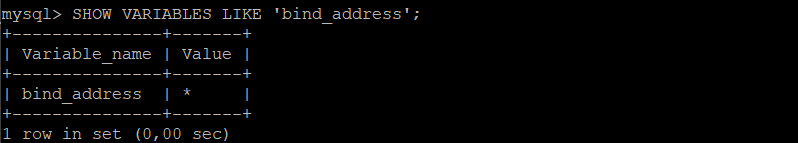

### Ejercicio 7. Encuentra todas las variables que tengan la palabra buffer en cualquier parte del nombre.

`SHOW VARIABLES LIKE '%buffer%';`

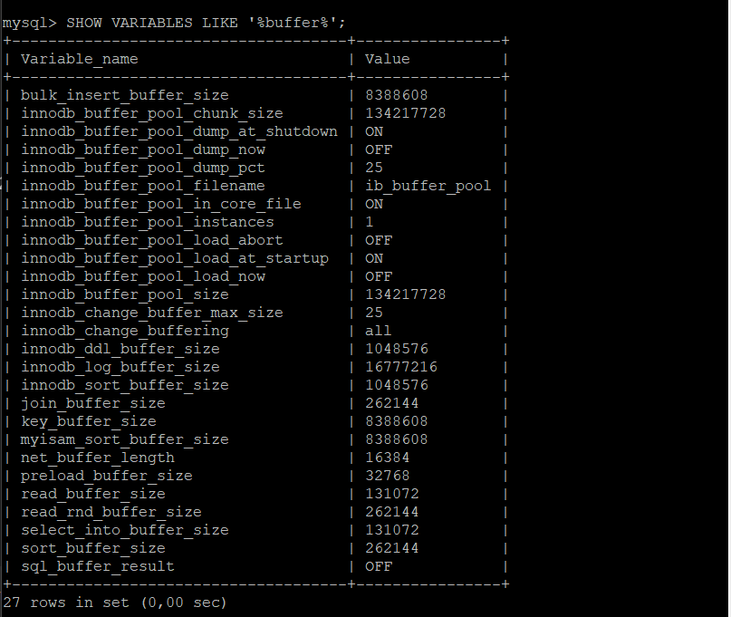

### Ejercicio 8. Muestra todas las variables que contengan la palabra dir.

`SHOW VARIABLES LIKE '%dir%';`

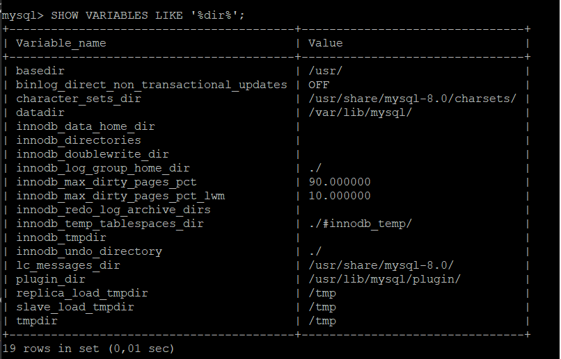

### Ejercicio 9. Cargar el fichero `tienda-productos.sql` en Base de Datos. Para ello utiliza el comando SOURCE con rutas relativas.

`SOURCE tienda-productos.sql;`

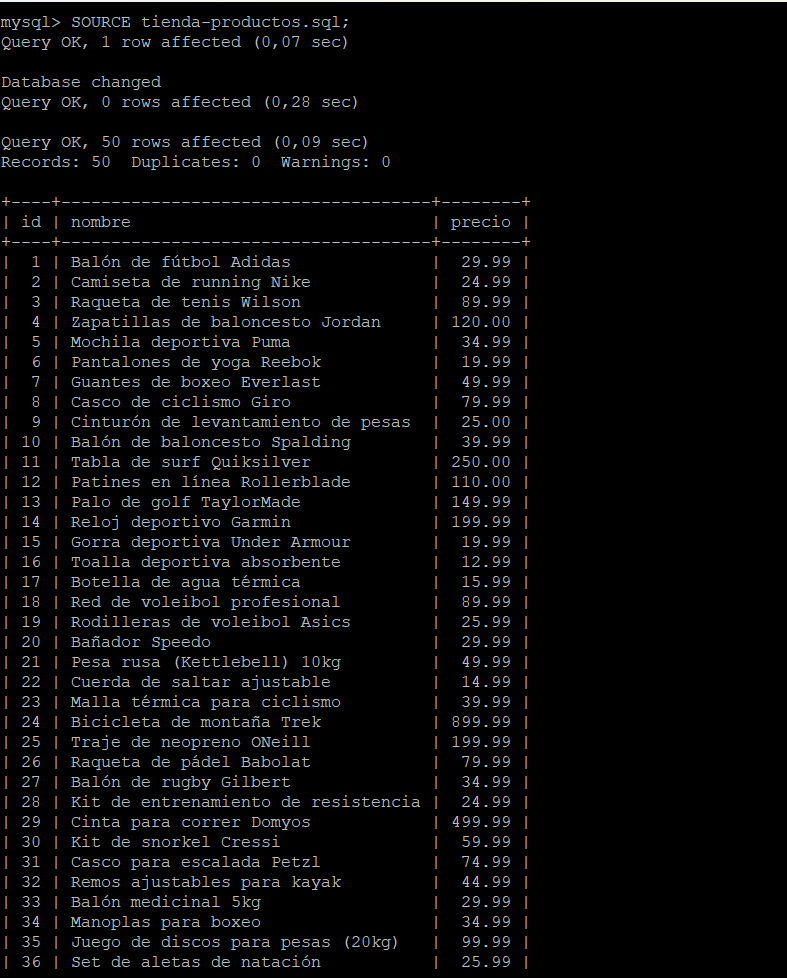

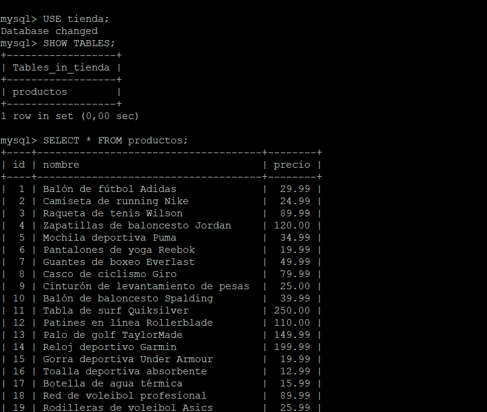

### Ejercicio 10. Cargar el fichero `tienda-clientes.sql` en Base de Datos. Para ello utiliza el comando SOURCE con rutas absolutas.

`SOURCE /home/alumno/tienda-clientes.sql;`

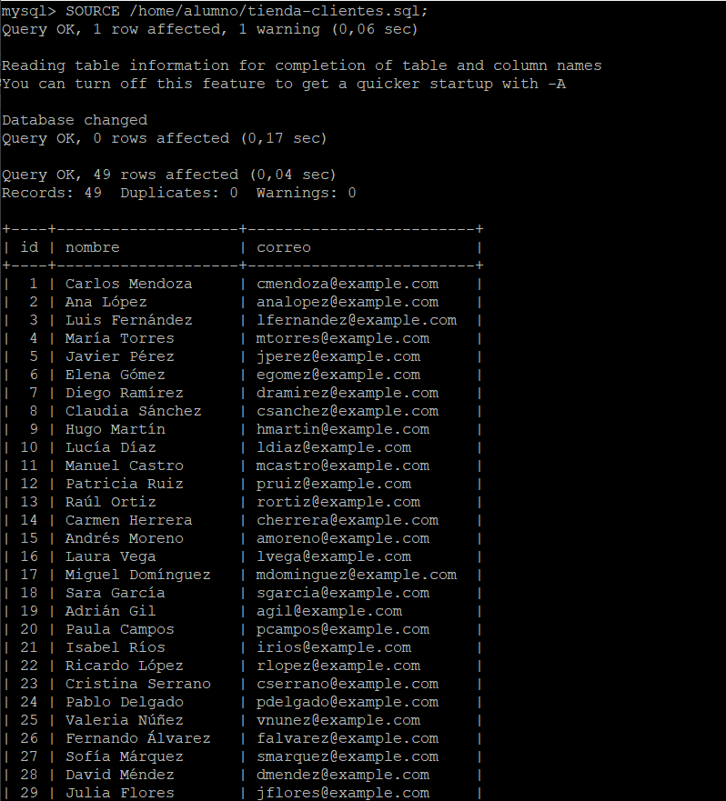

